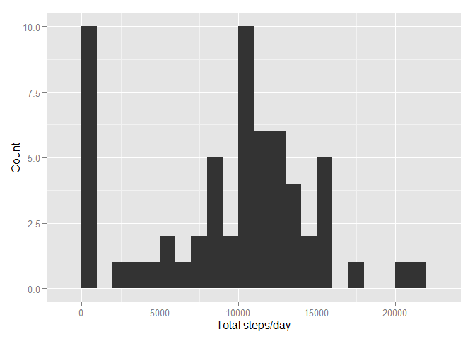
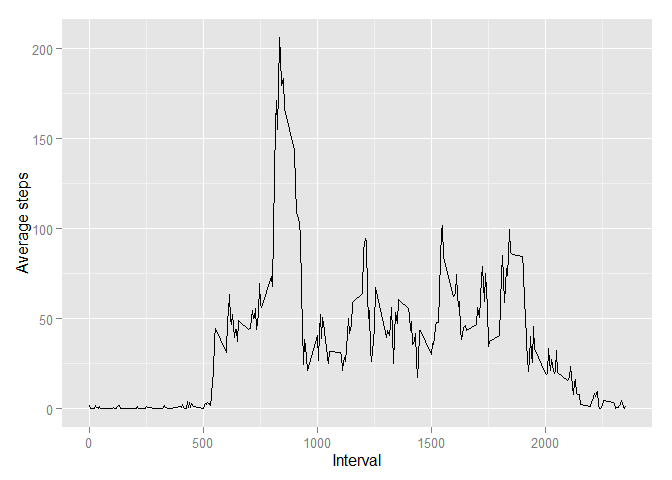
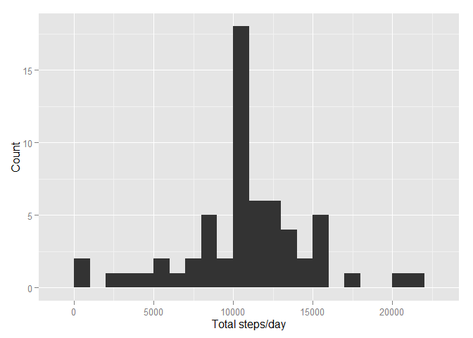
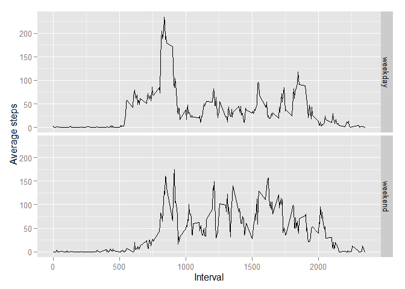

# Reproducible Research: Peer Assessment 1


## Loading and preprocessing the data

Firstly, load required libraries for these analyses:

```r
library(dplyr)
```

```
## 
## Attaching package: 'dplyr'
## 
## The following object is masked from 'package:stats':
## 
##     filter
## 
## The following objects are masked from 'package:base':
## 
##     intersect, setdiff, setequal, union
```

```r
library(lubridate)
library(ggplot2)
```
Then import the data from activity.csv file, and perform initial preprocessing:

```r
data<-read.csv("activity.csv")%>%
    mutate(date=ymd(date))
```

## What is mean total number of steps taken per day?

Initially, summarise the data by day:

```r
summary.by.day<-data%>%
    group_by(date)%>%
    summarise(total=sum(steps,na.rm=TRUE))
```

Plot the total steps per day as a histogram:

```r
qplot(summary.by.day$total,binwidth=1000,xlab="Total steps/day",ylab = "Count")
```

 

Finally, we can calculate the mean (9354.2295082) and median (10395) steps per day:


## What is the average daily activity pattern?

For this, we need to summarise the data by each interval:

```r
summary.by.interval<-data%>%
    group_by(interval)%>%
    summarise(mean=mean(steps,na.rm=TRUE))
```

Now we can plot the average activity over the course of a day:

```r
qplot(interval,mean,data=summary.by.interval,geom="line",xlab="Interval",ylab="Average steps")
```

 

And the interval with the most steps was therefore 835, with 206.17 steps.


## Imputing missing values

The dataset has 2304 missing values. We imputed data for these missing values by replacing them with the mean value for that interval, as follows:


```r
imputed.data<-data%>%
    left_join(summary.by.interval, by="interval")%>%
    mutate(imputed.steps=ifelse(is.na(steps), mean, steps))%>%
    select(interval,date,steps=imputed.steps)
```

The previous activity per day analysis can now be repeated:


```r
imputed.summary.by.day <- imputed.data%>%
    group_by(date)%>%
    summarise(total=sum(steps))
qplot(imputed.summary.by.day$total,binwidth=1000,xlab="Total steps/day",ylab = "Count")
```

 

The new mean (1.0766189\times 10^{4}) is now identical to the new median (1.0766189\times 10^{4}), and both are higher than the previous averages. This is because for several days there were no values recorded, and so the total steps for those days were zero. imputing average scores at these points therefore has raised the median, and to a greater extent, the mean.

## Are there differences in activity patterns between weekdays and weekends?

Add a new variable to the datset to mark whether the given day is a weekday or weekend:


```r
data_weekdays<-mutate(data,weekday=factor(ifelse(wday(date)%in%2:6,"weekday","weekend")))
```

And repeat the time-series plot, facetting against the weekend/weekday variable:


```r
data_weekdays<-mutate(data,weekday=factor(ifelse(wday(date)%in%2:6,"weekday","weekend")))
summary.by.interval_weekdays<-data_weekdays%>%
    group_by(interval,weekday)%>%
    summarise(mean=mean(steps,na.rm=TRUE))
qplot(interval,mean,data=summary.by.interval_weekdays,geom="line",xlab="Interval",ylab="Average steps",facets = weekday~.)
```

 
